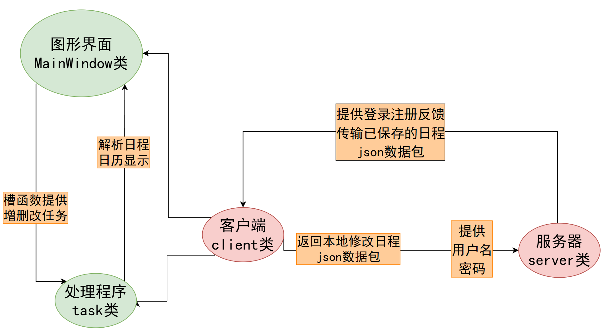
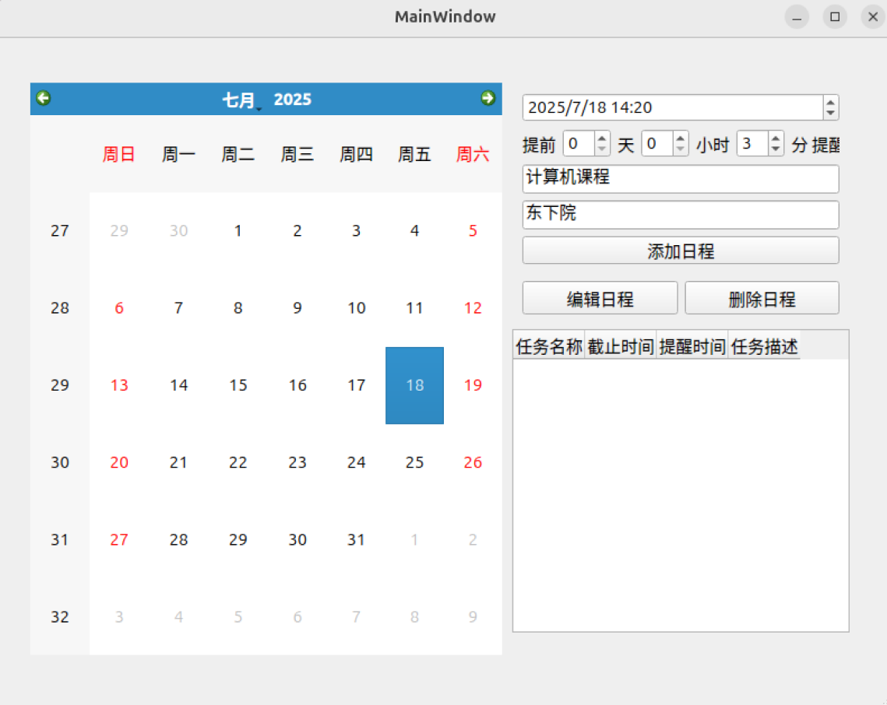
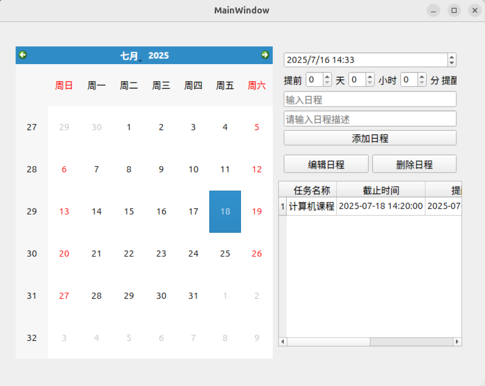
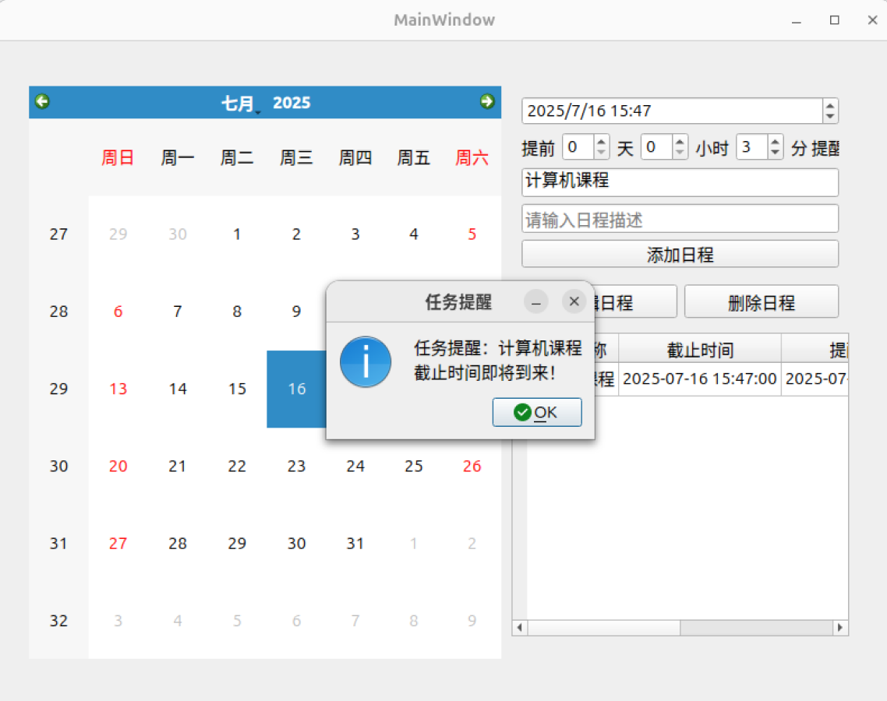
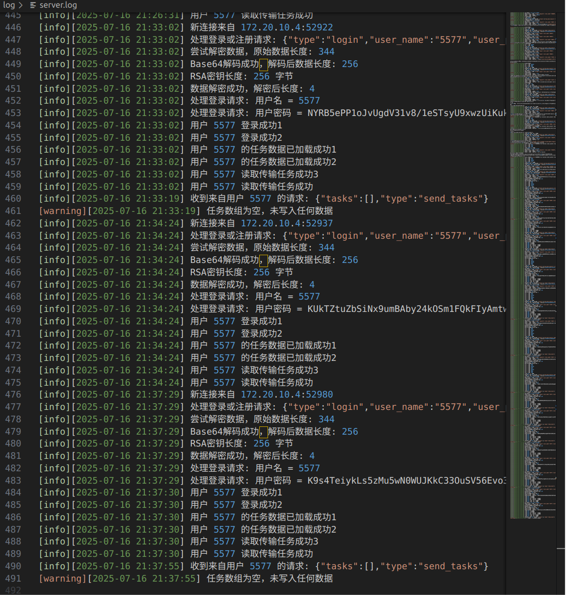
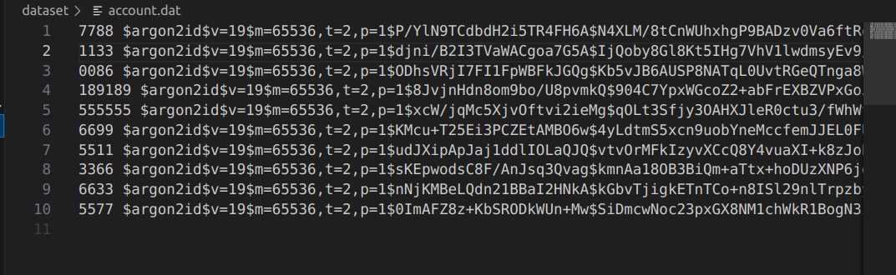
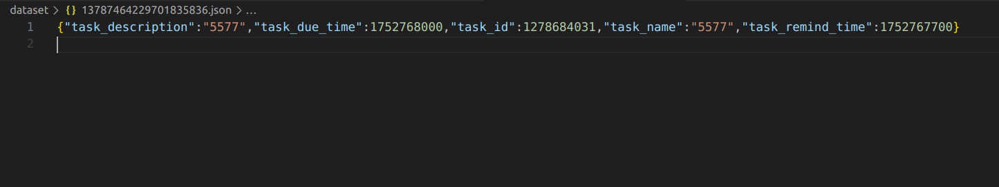

# Schedule Manager 
## Version :sunglasses:
* **GUI图形界面**及**局域网云存储**版本
  
## Feature  :pushpin:
  * 实现用户端`client`与服务器端`server`的交互
  * **局域网内 tcp::Socket**的加密通信及云存储 
  * 后端服务器能够承受**低中规模的并发连接**并**异步处理**
  * 支持跨设备同账号任务同步
  * 支持 Linux QT 图形界面, 交互友好 
  * 定时弹窗提醒
  * 登录信息与用户文件加密存储
## Project Structure :open_file_folder:
```
ScheduleManager/                            ScheduleManager/      
|  frontend/                                |  backend/
|  ├── CMakeLists.txt                       |  ├── CMakeLists.txt
|  ├── include/                             |  ├── include/
|  │   ├── FLAG.h                           |  │   ├── task.h 
|  │   ├── scan.h                           |  │   ├── server.h
|  │   ├── task.h                           |  │   ├── info_prompt.h
|  │   ├── mainwindow.h                     |  ├── src/
|  │   ├── task_manager.h                   |  │   ├── main.cpp
|  │   ├── thread_lock.h                    |  │   ├── task.cc
|  │   ├── login_window.h                   |  │   ├── info_prompt.cpp
|  │   └── register_window.h                |  ├── dataset/
|  ├── src/                                 |  ├── key/
|  │   ├── main.cpp                         |  │   └── private.pem
|  │   ├── mainwindow.cc                    |  ├── log/
|  │   ├── client.cpp                       |  │   └── client.log
|  │   ├── scan.cc                          |  └── build/
|  │   ├── task.cc
|  │   ├── task_manager.cpp
|  │   ├── login_window.cpp
|  │   └── register_window.cpp
|  ├── dataset/
|  ├── key/
|  │   └── public.pem
|  ├── log/
|  │   └── client.log
|  └── build/ 
```
## Introduction :memo:

### 模块与类的设计

#### 前端客户侧
* ``task_manager``类负责管理和操作用户的任务(``task`` 对象)，承担着“业务逻辑层”的职责，将界面层(如 ``Qt UI``)与底层数据(``task`` 对象集合)有效衔接,提供口供前端槽函数绑定。 
* ``client``类是基于 **Qt 框架**开发的客户端通信管理类，其核心职责是在 **GUI 客户端与服务端之间建立**、**维护并利用 TCP socket 实现稳定可靠的数据通信**，**支撑用户登录、注册、任务同步**等核心功能.该类面向 ***局域网内*** 的任务管理系统，封装了所有与服务端通信相关的操作逻辑，使得前端 GUI 逻辑可以高度解耦于底层网络通信细节,并且设计有``log``类方法记录相关日志，便于后续维护与排查。  
主要技术模块如下: 
  *  **Qt 网络模块（QTcpSocket）**: 实现 TCP 客户端连接、发送/接收字节流数据
  *  **Qt JSON 模块（QJsonDocument / QJsonObject / QJsonArray）**: 构建和解析客户端与服务器之间传递的数据
  *  **RSA privatekey加密** ： 对user_password进行密钥加密后再**Socket**传输，确保安全性
  *  **日志系统** : 自定义 log() 方法记录服务行为与异常信息，支持 [INFO], [WARNING], [ERROR] 等等级分类

* ``MainWindow 类``作为程序的主界面窗口，负责图形用户界面（**GUI**）的构建与用户交互处理，主要职责包括：
  * **事件响应与信号槽连接**：绑定按钮点击、表格选择等事件,调用对应的槽函数处理业务逻辑。
  * **任务数据管理**：接收用户输入，调用 task_manager 类的接口完成任务的编辑和刷新显示等功能
  * **任务提醒机制**：结合 scan 类实现任务提醒逻辑，提醒用户注意重要的日程安排
  * **多线程友好**设计时考虑多线程访问任务数据的安全，通过信号槽机制及锁的配合


* ``task``类是任务管理系统中用于表示单个任务的数据结构类，负责封装每一项任务的名称、描述、截止时间、提醒时间、唯一编号等属性，并提供相关接口实现任务对象的构建与展示。该类支持：任务时间的自动转换与计算与**QtJsonObj**可序列化与反序列化的接口  
  主要技术模块:
  * **std::time_t** ： 用于表示任务的截止时间与提醒时间（秒级时间戳），方便时间比较
  * **mktime** ： 将结构化的年月日时分秒转换为``time_t``
  * ``enum``**枚举常量** : 定义时间单位转换系数，便于进行“提前提醒时间”的差值计算,增强可读性


#### 后端数据库

* ``server``类是本地任务管理系统中的服务端核心组件，负责**客户端连接管理**、**用户身份认证**、**任务数据的读取与写入**以及**通信协议的响应处理**。  它基于 ``Boost.Asio ``实现**异步 TCP**网络服务，同时结合 **JSON**与文件系统构建轻量级后端，支持多用户并发处理和任务数据持久化。  
  主要技术模块如下:
  * **Boost.Asio** : 实现 TCP 异步监听与 socket 通信，支持多线程并发客户端会话
  * **nlohmann::json** : 用于 JSON 数据的构造与解析，承担客户端与服务端之间通信格式
  * **RSA pubickey解密** : 包装``std::string server::rsa_pub_decrypt(...)``函数对``password``解密
  * **std::thread** : 会话处理采用线程并发，每个客户端连接独立线程服务 
  * **fstream** : 用户任务数据采用 .json 文件本地存储，按用户名哈希区分,提高数据泄漏的安全保密性
  * **日志系统** : 自定义``log()`` 方法记录服务行为与异常信息，支持 [INFO], [WARNING], [ERROR] 等等级分类
  
* ``useraccount``类是后端任务管理系统中的**用户账户管理类**，负责账号的**注册**、**登录验证**、**密码哈希与持久化**等功能，保证用户身份认证的安全一致性。它通过本地文件存储加密后的用户密码，实现轻量级、独立型的账户系统。  
  主要技术模块如下:
  * **libsodium 密码哈希库** : 使用``crypto_pwhash_str``进行密码哈希，借助Argon2 算法核验身份保证安全
  * **map<string, string>** : 内存中存储用户名与加密密码``std::map``映射，便于快速查找与验证
  * **文件持久化（C++ STL I/O）**: 所有用户数据存储于 account.dat，每行为一个用户名及其密码哈希,以防密码泄漏
  
* ``task``类是任务管理系统中用于表示单个任务的数据结构类，负责封装每一项任务的名称、描述、截止时间、提醒时间、唯一编号等属性，并提供相关接口实现任务对象的构建与展示。该类支持：任务时间的自动转换与计算与**QtJsonObj**可序列化与反序列化的接口  
  主要技术模块:
  * **std::time_t** ： 用于表示任务的截止时间与提醒时间（秒级时间戳），方便时间比较
  * **mktime** ： 将结构化的年月日时分秒转换为``time_t``
  * ``enum``**枚举常量** : 定义时间单位转换系数，便于进行“提前提醒时间”的差值计算,增强可读性


* ``info_prompt``类用于后端服务器命令行上的信息提示与指引,并结合``signal_handle``全局函数捕捉``Ctrl+C``的**SIGINT**退出信号，实现优雅退出
  
---

### 流程图



---
### 关键技术问题说明
#### 多线程
* 客户端双线程，一个线程处理用户操作，一个线程扫描已有任务定时提醒...........
* 服务器为每一个客户端**Session**提供一个线程进行**Socket**连接，处理信息接受和分发。该设计初步预计可以承受千级别的并发连接处理
```
std::thread(&server::session_handler, this, std::move(socket)).detach();
```
#### 互斥锁的设计
```
template<typename Function, typename SharedType>
void call_with_lock(Function task_func, 
                    SharedType& shared,     
                    std::atomic<FLAG>& flag, 
                    std::mutex& mtx)
{
    auto lock_access = [&](function<void(SharedType&)> access_fn) 
    {
    lock_guard<mutex> lock(mtx);    
    access_fn(shared);                        
    };
    while(flag) //SUCCESS_LOGGED_IN
        task_func(lock_access);  
}
```
上述函数是一个通用的带互斥锁保护的任务调度器，用于在多线程环境下访问共享资源``shared``。

* 外部传入一个“任务函数”（task_func）作为参数，该函数内部可以安全访问``shared``。

* 定义一个``lambda``lock_access函数，所有对共享资源的访问都通过一个受 mutex 保护的闭包 lock_access 进行；

* 主循环受 flag 控制，当 flag 仍处于 SUCCESS_LOGGED_IN（自定义枚举值）状态时不断运行。
* 共享资源``shared``此处为``vector<task> tasks``,仅需在主函数中维护，其他类方法与函数都可以安全访问同一个``tasks``，确保更新同步，并且其他类无需额外存储``vector<task>``,节省空间。
#### 前端GUI
主界面通过 mainwindow.ui 构建，实现以下核心功能：

* 日历选择（QCalendarWidget）：用户点击日期查看当天任务。

* 任务展示（QTableWidget）：以表格形式显示所选日期的任务列表。

* 任务添加：

  * 输入任务名称与描述；

  * 设置截止时间与提醒时间（天/小时/分钟）；

  * 点击“添加日程”按钮将任务加入列表。

* 任务管理：
  * “编辑日程”：使用输入框的内容替换修改选中任务；
  * “删除日程”：移除选中任务。
#### TCP通信
* 结构：局域网内利用TCP::Socket协议实现客户端和服务器的连接通讯。前端GUI界面并且处理用户指令，后端服务器作数据库云存储。
* 模块：前端``client``类代理负责实现**Qt** ``MainWindow``的**TCP::Socket**通信，后端``Server``类负责接受前端信息，进行任务读取的返回或任务的写入文件存储。
* 信息流：利用``QtJSON``与``Json``格式进行信息流的传递，便于两端的解析信息包并作出匹配的响应
* 通信加密 : 利用``openssl``公密钥非对称密钥的加密策略，加密``password``。``client``类存储``public.pem``进行**private_key encrypt**密钥加密;``server``类存储``private.pem``进行**public_key decrypt**公钥解密

#### 后端捕捉``Ctrl+C``的**SIGINT**信号与main非阻塞
* 后端启动后常态运行，按``Ctrl+C``结束进程，定义信号处理函数``signal_handler``,打印退出提醒并修改``stop_flag``以让``main``函数结束进程
```
#include <csignal>  

void signal_handler(int signal) 
{
    if (signal == SIGINT) 
    {
        if (global_prompt) 
        {
            global_prompt->quit_program();  // 打印退出信息
        }
        stop_flag = true;  // 设置退出标志
    }
}
```
* ``main``函数中有循环如下，利用``while``+``io_context.poll()``模拟``io.run()``的循环，且为非阻塞式，更具健壮性和鲁棒性
```
while (!stop_flag) 
  {
    io_context.poll();  // 非阻塞处理事件
    std::this_thread::sleep_for(std::chrono::milliseconds(1000));
  }

```

## Getting Started :rocket:

### GUI版本（需要至少两台pc端电脑分别作客户端与服务器）
* 进入**github**, ``git clone``相关文件
  ```
  git clone -----------
  ```
* 服务器数据库操作如下：
  * 确保服务器与客户端在同一局域网内，才可通信，并扫描服务器的 **ip地址**(需记录，客户端需使用)
  ```
  ip a        
  #查看服务器本机ip地址
  ```
  * 进入 **backend/build** 目录
  ```
  cd backend/build
  ```
  * 通过CMake工具编译相关文件
  ```
  cmake ..
  make
  ```
  * 返回 **backend**项目前端目录
  ```
  cd ..   
  #注意这里一定要回到 backend/ 下确保相关文件读取写入的相对路径正确
  ```
  * 运行可执行文件，可以看到终端命令行提醒
  ```
  ./build/bin/......
  ```

* 客户端操作如下:
  * 进入 **frontend/build** 目录
  ```
  cd frontend/build
  ```
  * 通过CMake工具编译相关文件
  ```
  cmake ..
  make
  ```
  * 返回 **frontend**项目前端目录
  ```
  cd ..   
  #注意这里一定要回到 frontend/ 下确保相关文件读取写入的相对路径正确
  ```
  * 运行可执行文件,进入图形界面
  ```
  ./build/bin/......
  ```
* 关于通信加密的 **private.pem** 与 **public.pem** 的公密钥对，默认配置已存在，想要自己生成操作如下
  * 删除原有的公钥与密钥配置
  ```
  rm -f ./frontend/key/private.pem
  rm -f ./backend/key/public.pem
  ```
  * 利用 **openssl** 生成新的公钥密钥对
  ```
  cd ./frontend/key   
  #or cd ./backend/key
  openssl genrsa -out private.pem 2048
  openssl rsa -in private.pem -inform pem -pubout -out public.pem
  
  #再利用安全的传输方式，
  #将 private.pem 放在 frontend/key/目录下
  #将 public.pem 放在 backend/key/目录下
  ```


## Contributor :eyes:
  
| Name | Student ID | email  |
|--------|--------|--------|
| Zhongchun Chen(陈忠淳)  | 524031910806  | pocket.chen@sjtu.edu.cn  |
| Zheyu Liu(刘雨哲) | 524031910651  | fengyu21@sjtu.edu.cn  |
| Yongyi He(何泳逸) |    524031910719 |heyongyi@sjtu.edu.cn|


## Division 	:desktop_computer:
### Zhongchun Chen
* 双线程(一个线程处理用户操作指令+一个线程扫描添加任务到期提醒)和相关内存互斥锁的设计。
* ``scan``类的设计，给类用于扫描``vector<task> tasks``中需要提醒的任务并弹出。
* 基于``schedule``类分离重构了``task``类和``task_manager``类。
* 为实现``socket``通信和前后端分离，对``task``类进一步修改，借助**json**格式传输信息，为实现**json解析**修改了``task``类的数据成员与接口。
* 实现局域网内借助``tcp::socket``通信的基本功能，分别为前端设计``clinet``类处理**Qt GUI**的网络通信，为后端设计``server``类处理数据库的网络通信。

### YuZhe Liu
* 设计``useraccount``类，用于处理关于用户的**login**与**register**的登录注册逻辑
* ``useraccount``类通过sodium库来对密码进行加密，并存入account.dat文件
* 整理调试**baseline命令行版本**的``main``函数，解决了不同接口对接调用时的bug，并完成命令行交互设计
* 基于``QT``设计登录界面，基于``clinet``类处理完成数据的接收，完成``scan``类在GUI中相应的修改，并整合图形界面代码，解决出现的bug，测试效果是否达预期。

### Yongyi He
* 设计初版``schedule``类
* 基于``schedule``类分离重构了``task``类和``task_manager``类，提供良好接口
* 设计``task``类作为全局任务的基础对象......
* 设计``task_manager``类实现对用户操作任务的不同指令的响应
* 基于``QT``设计日程图形界面，实现添加、编辑等按钮的功能并完成槽函数的连接，实现将基本程序接入图形界面


## Experiments :wrench:
<h3>主界面 & 任务列表</h3>
  

<h3>任务提醒 & Log文件</h3>


<h3>服务器端加密存储的用户信息</h3>


<!--  -->
<h3>服务器端存储的任务信息(文件名已加密)</h3>


<!--  -->

## Discussion :thinking:
* 后端服务器对每个**Session**的连接分别开一个线程，存在浪费性能的隐患，可能无法面对百万级别的并发连接。
  * ***后续优化单线程处理多Session连接，提高面对高并发的处理能力***
* **Tcp::Socket** 局域网通信过程只利用**RAS**公钥对对``password``进行加密传输，若上升到更大不安全的网络内，可能存在攻击者截获信息流，再向服务器发送信息。(原加密方案针对安全可靠的局域网内)。
  * ***后续优化authenticator认证，保证信息传输的安全性***
* 在非对称的加密的身份核实后，``task``相关内容都没有进行加密处理。
  * ***后续优化，在非对称加密时一并传入客户端生成的AES对称密钥，后续通讯内容有AES加密解密，安全与效率较高***

## License :page_facing_up:

This project is licensed under the [MIT License](./LICENSE) © 2025 Zhongchun Chen, Yuzhe Liu, Yongyi He.
